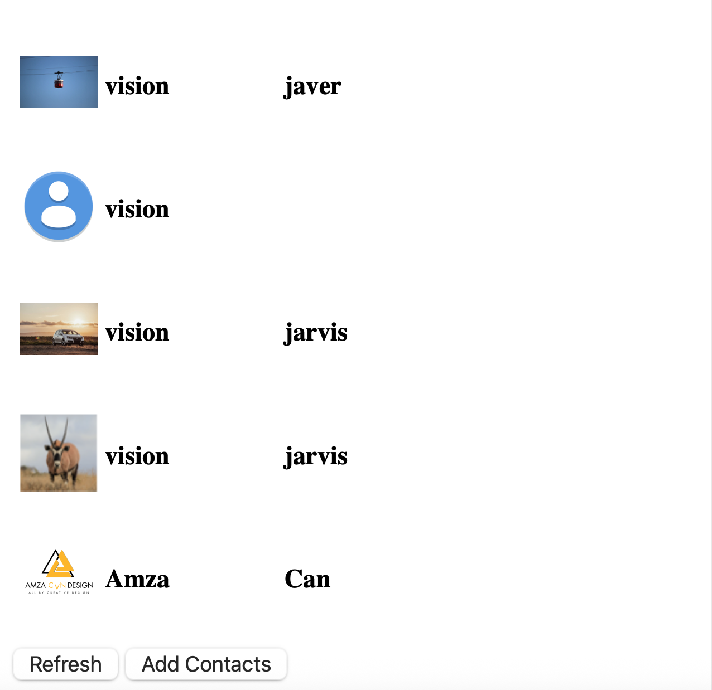
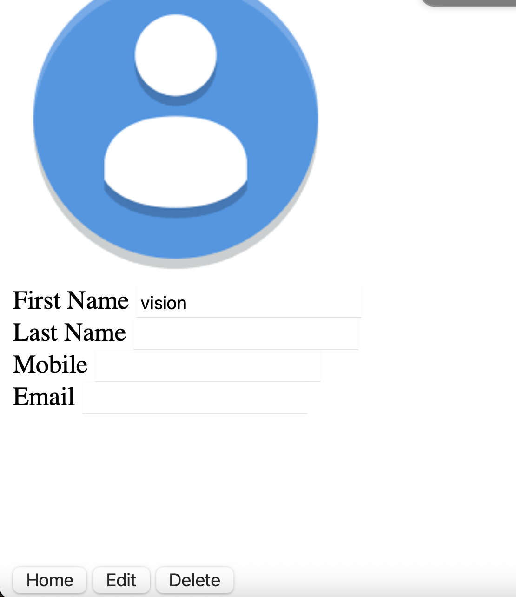

# 📇 Contact Book App

A simple and intuitive **Contact Book Web App** built with **HTML**, **CSS**, and **JavaScript**.  
This app allows users to **create**, **edit**, and **delete** contacts with ease. All data is managed on the client side using JavaScript.

---

## ✨ Features

- ➕ Add new contacts with name, phone number, and email  
- ✏️ Edit existing contacts  
- 🗑️ Delete contacts from the list  
- 🏠 Clean and responsive UI with real-time updates  
- 💾 Persistent data storage using local storage (optional if implemented)

---

## 📸 Screenshots

### 🏠 Home Page



---

### 📝 Editable Page



---

## 🛠️ Tech Stack

- HTML5  
- CSS3  
- JavaScript (Vanilla)

---

## 🚀 How to Run Locally

1. **Clone this repository**:
   ```bash
   git clone https://github.com/your-username/contact-book-app.git
